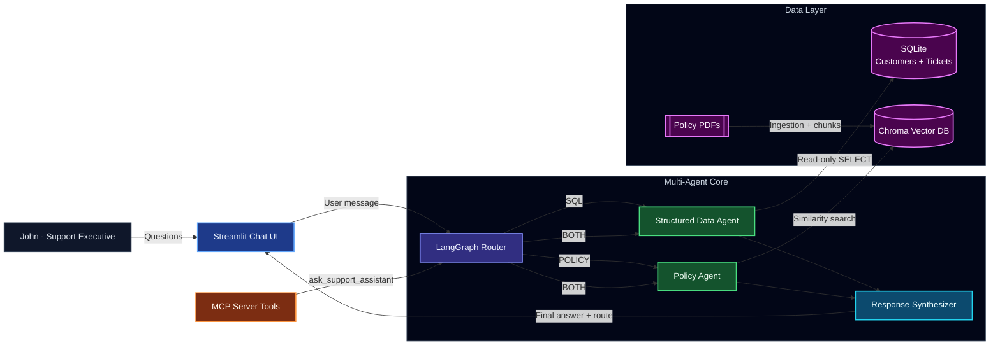

# Generative AI Multi-Agent Customer Support Chatbot

A beginner-friendly project that answers support questions from:
- Structured data in SQL (customer profiles + ticket history)
- Unstructured policy PDFs (refund/terms/support docs)

Built using the required stack:
- LangChain + LangGraph
- OpenAI LLM + OpenAI embeddings
- SQLite + Chroma Vector DB
- MCP Server
- Streamlit UI

## What This App Does

You can ask questions like:
- "What is the current refund policy?"
- "Give me a quick overview of customer Emma Brown and her past support tickets."
- "Based on Emma's ticket, what policy applies?"

The app routes your question to the right agent:
- SQL Agent for database questions
- Policy Agent for PDF/policy questions
- Both Agents for mixed questions

## Architecture



## Project Setup

### Prerequisites

- Python `3.10+`
- OpenAI API key with active quota/billing

### 1. Create and activate a virtual environment

```powershell
python -m venv .venv
.\.venv\Scripts\Activate.ps1
```

### 2. Install dependencies

```powershell
python -m pip install --upgrade pip
pip install -r requirements.txt
```

### 3. Configure environment variables

```powershell
copy .env.example .env
```

Set the required values in `.env`:

```env
OPENAI_API_KEY=your_openai_api_key
OPENAI_MODEL=gpt-4o-mini
OPENAI_EMBEDDING_MODEL=text-embedding-3-small
SQLITE_PATH=./data/support.db
CHROMA_PERSIST_DIR=./data/chroma
AUTO_SEED_SQL_IF_EMPTY=true
SHOW_SETUP_UI=false
```

Configuration notes:
- `AUTO_SEED_SQL_IF_EMPTY=true`: auto-initializes synthetic SQL data if DB is empty.
- `SHOW_SETUP_UI=false`: hides admin-only setup controls from the public UI.

## Usage Instructions

### A. Run Streamlit application

```powershell
streamlit run src/streamlit_app.py
```

Once the app is running:
1. Place policy PDFs in `./policy_docs` (create folder if needed).
2. In the sidebar, click `Ingest PDFs`.
3. Start asking questions in chat.

### B. Run MCP server

```powershell
python src/mcp_server.py
```

Available MCP tools:
- `initialize_sql_data()`
- `ingest_policy_pdfs(directory: str)`
- `ask_support_assistant(question: str)`
- `ask_support_assistant_with_route(question: str)`

### C. Expected behavior

- The router chooses `SQL`, `POLICY`, `BOTH`, or `NONE` per query.
- SQL execution is read-only (`SELECT` only).
- Policy responses include source citations from ingested PDFs.

## Sample Questions

- `What is the refund eligibility window?`
- `Does cancellation automatically trigger a refund?`
- `Show Emma Brown's profile and past support tickets.`
- `Which tickets are high priority and still open?`
- `Emma had a duplicate charge refund. What policy applies to her case?`

## Troubleshooting

- `429 insufficient_quota`: your OpenAI project has no available quota/billing.
- `No PDF files found`: ensure files exist in `./policy_docs` and use `.pdf` extension.
- UI uses old session state after code changes: restart Streamlit.

