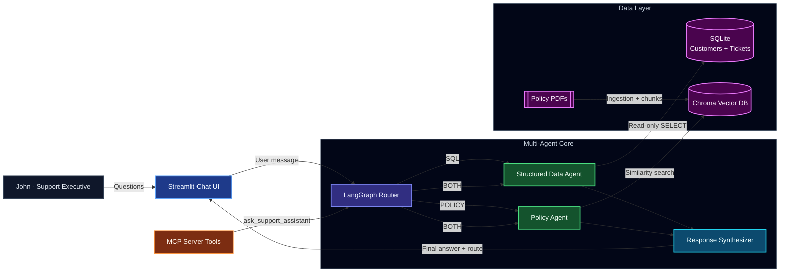

# Generative AI Multi-Agent Customer Support Chatbot

## Overview

This project is a multi-agent customer support assistant that answers natural language questions using:
- Structured customer and ticket data from SQL
- Unstructured policy content from uploaded PDFs

## Tech Stack

- Orchestration: LangChain, LangGraph
- Models: OpenAI (LLM + embeddings)
- Databases: SQLite (structured), Chroma (vector)
- Interface: Streamlit
- Integration layer: MCP Server

## Architecture



## Project Setup

### Prerequisites

- Python `3.10+`
- OpenAI API key with active quota/billing

### 1. Create and activate a virtual environment

```powershell
python -m venv .venv
.\.venv\Scripts\Activate.ps1
```

### 2. Install dependencies

```powershell
python -m pip install --upgrade pip
pip install -r requirements.txt
```

### 3. Configure environment variables

```powershell
copy .env.example .env
```

Set the required values in `.env`:

```env
OPENAI_API_KEY=your_openai_api_key
OPENAI_MODEL=gpt-4o-mini
OPENAI_EMBEDDING_MODEL=text-embedding-3-small
SQLITE_PATH=./data/support.db
CHROMA_PERSIST_DIR=./data/chroma
AUTO_SEED_SQL_IF_EMPTY=true
SHOW_SETUP_UI=false
```

Configuration notes:
- `AUTO_SEED_SQL_IF_EMPTY=true`: auto-initializes synthetic SQL data if DB is empty.
- `SHOW_SETUP_UI=false`: hides admin-only setup controls from the public UI.

## Usage Instructions

<!-- ### Primary path (UI demo) -->

Start the Streamlit app:

```powershell
streamlit run src/streamlit_app.py
```

In the running UI:
1. Place policy PDFs in `./policy_docs` (create folder if needed).
2. In the sidebar, click `Ingest PDFs`.
3. Start asking questions in chat.

What to expect:
- SQL data is auto-seeded on first run if `AUTO_SEED_SQL_IF_EMPTY=true`.
- Each answer shows the selected route (`SQL`, `POLICY`, `BOTH`, `NONE`).
- Policy answers include citations from ingested PDFs.

MCP note:
- `src/mcp_server.py` exposes the same LangGraph multi-agent backend (`ChatbotService`) as MCP tools, so external MCP clients can invoke SQL retrieval, policy retrieval, and routed responses through a standardized server interface.

## Sample Questions

- `What is the refund eligibility window?`
- `Does cancellation automatically trigger a refund?`
- `Show Emma Brown's profile and past support tickets.`
- `Which tickets are high priority and still open?`
- `Emma had a duplicate charge refund. What policy applies to her case?`

## Troubleshooting

- `429 insufficient_quota`: your OpenAI project has no available quota/billing.
- `No PDF files found`: ensure files exist in `./policy_docs` and use `.pdf` extension.
- UI uses old session state after code changes: restart Streamlit.
