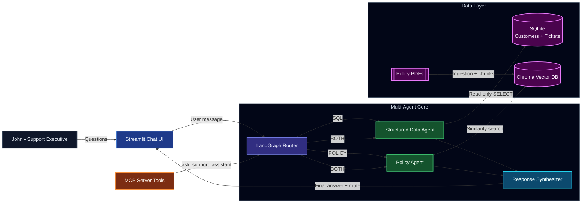

# Generative AI Multi-Agent Customer Support Chatbot

A beginner-friendly project that answers support questions from:
- Structured data in SQL (customer profiles + ticket history)
- Unstructured policy PDFs (refund/terms/support docs)

Built using the required stack:
- LangChain + LangGraph
- OpenAI LLM + OpenAI embeddings
- SQLite + Chroma Vector DB
- MCP Server
- Streamlit UI

## What This App Does

You can ask questions like:
- "What is the current refund policy?"
- "Give me a quick overview of customer Emma Brown and her past support tickets."
- "Based on Emma's ticket, what policy applies?"

The app routes your question to the right agent:
- SQL Agent for database questions
- Policy Agent for PDF/policy questions
- Both Agents for mixed questions

## Colorful Architecture Diagram



## Quick Start (Windows PowerShell)

### 1. Create and activate virtual environment

```powershell
python -m venv .venv
.\.venv\Scripts\Activate.ps1
```

### 2. Install dependencies

```powershell
pip install -r requirements.txt
```

### 3. Configure environment

```powershell
copy .env.example .env
```

Open `.env` and set:

```env
OPENAI_API_KEY=your_key_here
OPENAI_MODEL=gpt-4o-mini
OPENAI_EMBEDDING_MODEL=text-embedding-3-small
SQLITE_PATH=./data/support.db
CHROMA_PERSIST_DIR=./data/chroma
AUTO_SEED_SQL_IF_EMPTY=true
SHOW_SETUP_UI=false
```

## Run the App

### Streamlit (recommended for demo)

```powershell
streamlit run src/streamlit_app.py
```

In the UI sidebar:
1. Put policy PDFs in `./policy_docs`
2. Click `Ingest PDFs`
3. Start chatting

Notes:
- SQL demo data is auto-seeded if DB is empty (`AUTO_SEED_SQL_IF_EMPTY=true`)
- Admin setup controls are hidden by default (`SHOW_SETUP_UI=false`)

### MCP Server

```powershell
python src/mcp_server.py
```

MCP tools exposed:
- `initialize_sql_data()`
- `ingest_policy_pdfs(directory: str)`
- `ask_support_assistant(question: str)`
- `ask_support_assistant_with_route(question: str)`

## How Routing Works

The router picks one label for each question:
- `SQL`: customer/ticket data only
- `POLICY`: policy PDF info only
- `BOTH`: requires SQL + policy context
- `NONE`: unclear/unsupported

The selected route is shown in the Streamlit chat for transparency.

## Safety and Quality Features

- SQL guardrails: only safe read-only `SELECT` queries are executed
- Policy citations: answers include `[C1]` style references + source/page list
- Multi-agent synthesis: combines SQL + policy outputs for blended questions

## Example Questions to Try

Policy:
- "What is the refund eligibility window?"
- "Does cancellation automatically trigger a refund?"

SQL:
- "Show Emma Brown's profile and past support tickets."
- "Which tickets are high priority and still open?"

Mixed:
- "Emma had a duplicate charge refund. What policy applies to her case?"

## Troubleshooting

- `429 insufficient_quota`:
  - Your OpenAI project has no available quota/billing. Use a funded API key.

- `No PDF files found`:
  - Ensure your documents are in `./policy_docs` and have `.pdf` extension.

- `AttributeError: ask_with_meta` in Streamlit:
  - Restart Streamlit so old session objects are refreshed.

